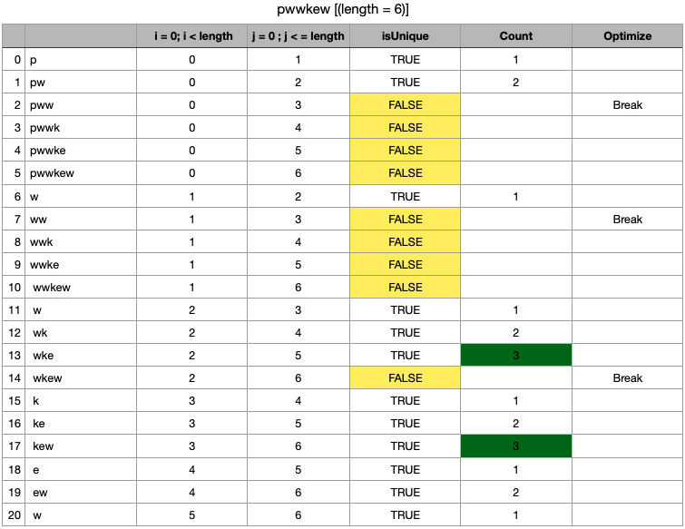
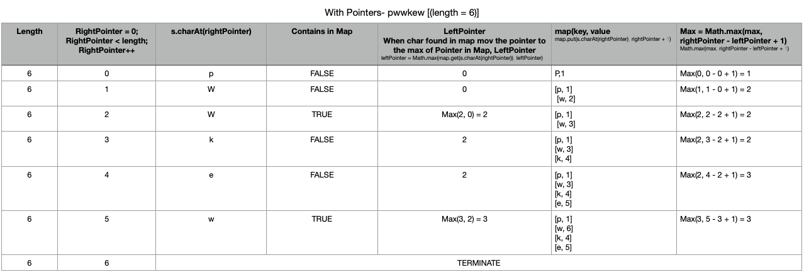

#Arrays

## Problems

1. Two Sum [Leet Problem](https://leetcode.com/explore/interview/card/amazon/76/array-and-strings/508/)
     
     [Source Code](../src/main/java/cs/fundamental/problems/leetcode/arraysandstrings/TwoSum.java)
     
     
     
2. Longest Substring Without Repeating Characters [Leet Problem](https://leetcode.com/explore/interview/card/amazon/76/array-and-strings/2961/)

    i. Longest Non Repeating SubString Brute Force and Naive Solution 
    
    MethodName: lengthOfLongestSubstringBruteForce() and lengthOfLongestSubstringNaive() [Source Code](../src/main/java/cs/fundamental/problems/leetcode/arraysandstrings/SubStringProblems.java)
    
    

    ii. Longest Non Repeating SubString Optimized Pointer Solution 
    
    MethodName: lengthOfLongestSubstring() [Source Code](../src/main/java/cs/fundamental/problems/leetcode/arraysandstrings/SubStringProblems.java)
    
    
