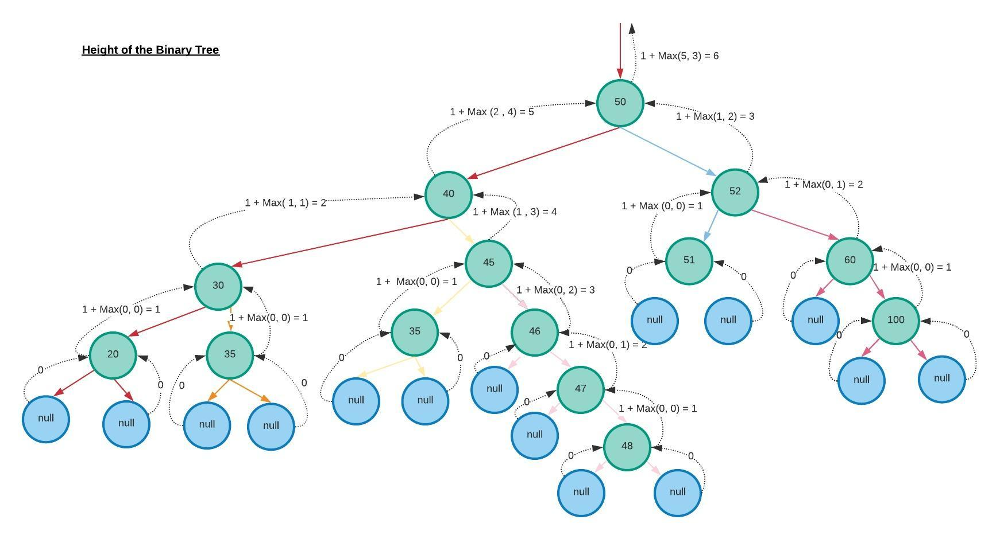
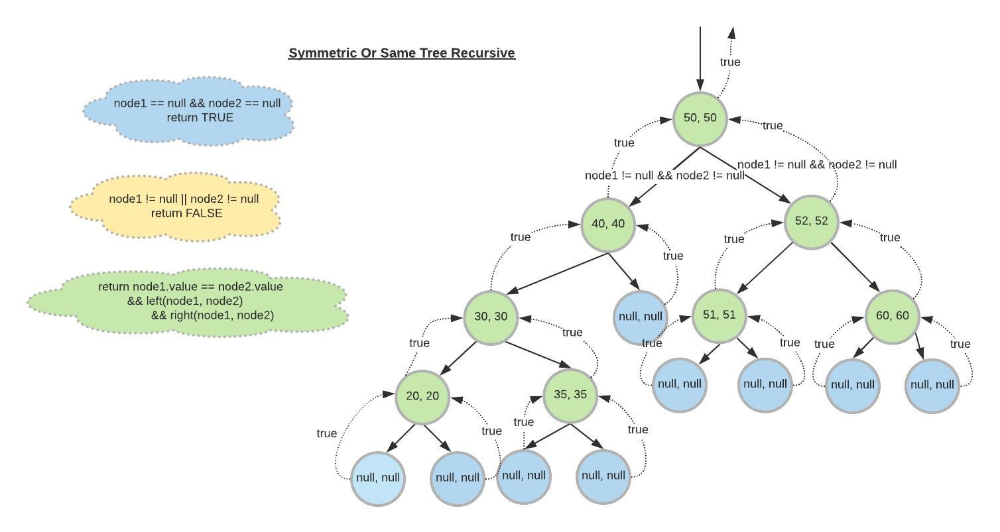
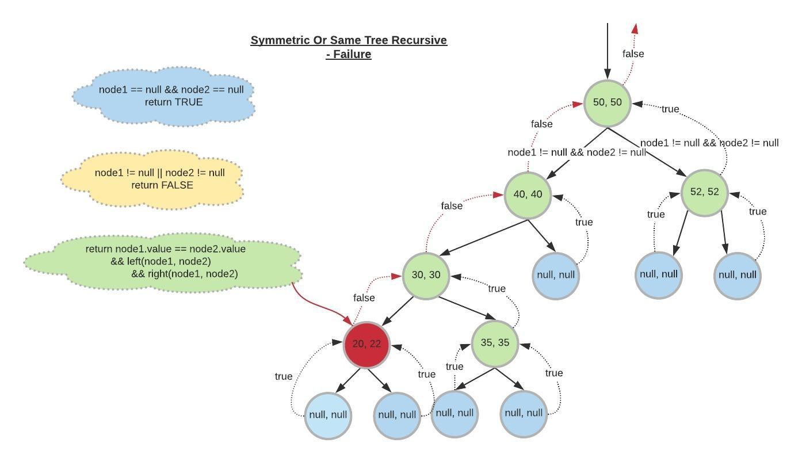

**[Go Home](../readme.md)**

# Trees            

A Tree is a Data structure which has its value and 2 pointers. 


```
TreeNode<T> {
   T value;
   TreeNode<T> leftChild;
   TreeNode<T> rightChild;
}
```

1. [Binary Tree](https://github.com/padminimandal-babylon/data_structures/blob/master/src/main/java/cs/fundamental/datastructures/BinaryTree.java#L11) 

## Traversing Binary Tree

1. [In-Order Traversal](https://github.com/padminimandal-babylon/data_structures/blob/master/src/main/java/cs/fundamental/datastructures/BinaryTree.java#L40)
2. [Pre-Order Traversal](https://github.com/padminimandal-babylon/data_structures/blob/master/src/main/java/cs/fundamental/datastructures/BinaryTree.java#L25)
3. [Post-Order Traversal](https://github.com/padminimandal-babylon/data_structures/blob/master/src/main/java/cs/fundamental/datastructures/BinaryTree.java#L55)
4. [Level-Order Traversal](https://github.com/padminimandal-babylon/data_structures/blob/master/src/main/java/cs/fundamental/datastructures/BinaryTree.java#L70)

## Algorithm with Binary Tree
1. [Height Of a given Binary Tree](https://github.com/padminimandal-babylon/data_structures/blob/master/src/main/java/cs/fundamental/problems/leetcode/tree/BinaryTreeProblems.java#L39) 

    Please comment if anything inconsistent on [LucidChart](https://app.lucidchart.com/invitations/accept/a85ce2c1-dabf-42e9-8678-a2320f26eb6a)
    
    
2. [Symmetric Tree Or Same Tree](https://github.com/padminimandal-babylon/data_structures/blob/master/src/main/java/cs/fundamental/problems/leetcode/tree/BinaryTreeProblems.java#L16)
     Please comment if anything inconsistent on [LucidChart](https://app.lucidchart.com/invitations/accept/6313938a-47b8-4ade-8696-e0cc02c481a8)
     
          
     Please comment if anything inconsistent on [LucidChart](https://app.lucidchart.com/invitations/accept/1eb270fa-d857-40ed-a230-a7f44a09db9e)
     
     
     When node values are not same- How the error propagates
     
     Please comment if anything inconsistent on [LucidChart](https://app.lucidchart.com/invitations/accept/4e049e64-34cf-41ca-853e-7b3998cfae8f)
     
     
**[Go Home](../readme.md)**
     